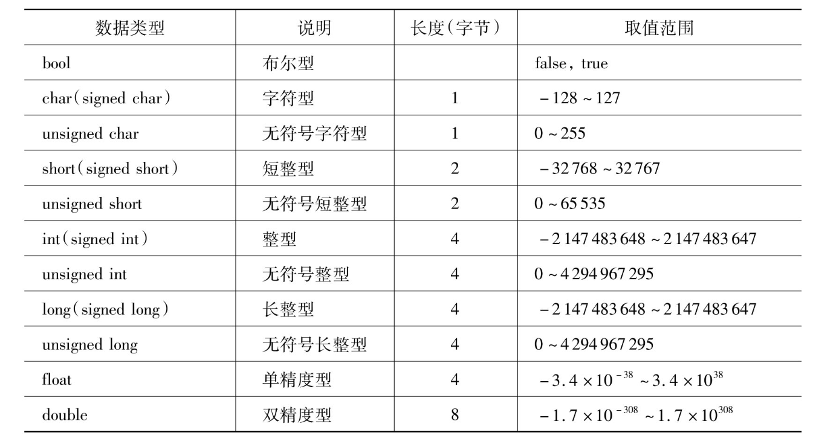

|基本数据类型| |
|:--|:--|
| int    | 用于表示整数                               |
| float  | 用于表示单精度浮点数                       |
| double | 用于表示双精度浮点数                       |
| char   | 用于表示字符                               |
| bool   | 用于表示布尔值，只能取 true 或 false       |
| void   | 表示无类型，通常用于函数返回类型或指针类型 |
| string (c++) | 字符串 |

​	

| 复合数据类型               |                                                          |
| -------------------------- | -------------------------------------------------------- |
| 数组 (arr[] or c++/vector) | 由相同类型的元素组成的集合                               |
| 结构体（struct）           | 由不同类型的成员组成的复合类型                           |
| 枚举（enum）               | 一组具有命名值的常量                                     |
| 类（class）                | 一种封装数据和操作的方式，支持面向对象编程               |
| 指针（pointer）            | 存储内存地址的变量，用于间接访问内存中的数据             |
| 引用（typedef）            | 提供现有变量的别名，用于简化代码和避免复制               |
| 字典  (c++/map)            | 拥有可以是不用类型的关键字和值，用于简化与方便管理、匹配 |

