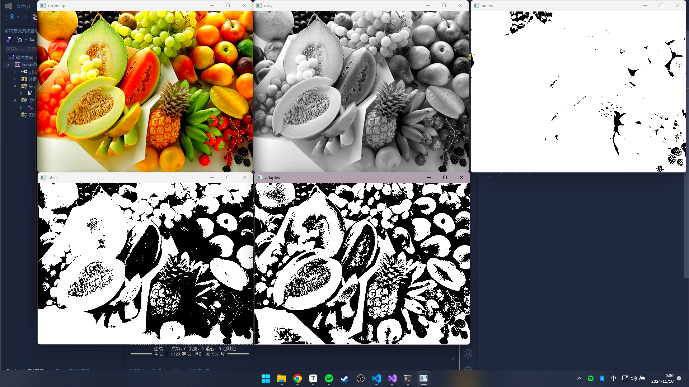

[TOC]

# OpenCV 函数查询   


## 1.**`imread`** 读取

```c++
Mat src = cv::imread("assets/1.jpg", cv::IMREAD_COLOR)
```

- **`flags`**
  - `cv::IMREAD_COLOR` 默认
  - `cv2.IMREAD_GRAYSCALE` 灰度图
- 配合 **`imshow`** 使用

---

## 2.**`cvtColor`** 转换颜色

```c++
Mat grayImg;
cv::cvtColor(this->src, grayImg, COLOR_BGR2GRAY); //转换为灰度图
```

- `cvtColor` -> `Convert Color`

---

## 3.**`split`** 分离 `BGR` 通道

```c++
std::vector<Mat> channels(3);
cv::split(this->src, channels); // split 为 3 个通道

cv::imshow("B", channels[0]);
cv::imshow("G", channels[1]);
cv::imshow("R", channels[2]);
```

---

## 4.**`crop`** 裁剪图像

```c++
// 裁剪图像，选择从行 100 到 300，列 50 到 300 的区域
c++cv::Mat crop = this->src(cv::Range(10, 170), cv::Range(40, 200));
```

---

## 5.**绘制相关**

```c++
auto drawn = this->src;

// 注意：Scalar 内为BGR形式
cv::line(drawn, Point(100, 200), Point(250, 250), Scalar(255, 0, 0), 2); //线
cv::rectangle(drawn, Point(150, 250), Point(250, 300), Scalar(255, 255, 255), 2); //矩形
cv::circle(drawn, Point(150, 300), 50, Scalar(100, 100, 0), 2); //圆
cv::putText(drawn, "text", Point(200, 250), 0, 0.5f, rgb(0, 0xFF, 0xFF), 2, cv::LINE_8); //文本

imshow("drawn", drawn);
```

- `putText` 中 `lineType` 参数：
  - lineType 这个参数控制着文本渲染时的线条类型，通常有以下几种常见的选项：

  - cv::LINE_8（默认值）：
		该值表示使用 8 位的线条类型（即标准的 8 点法）。这是最常用的线条类型，适用于大多数普通文本渲染。它会渲染出较为平滑的文本，适合显示较小的文本。
  - cv::LINE_4：
		该值表示使用 4 位的线条类型。相比 cv::LINE_8，它的渲染精度较低，通常在图像较小或者较低分辨率时使用。它的表现可能会比 cv::LINE_8 更粗糙，不适合用于较大的文本。
  - cv::LINE_AA：
		该值表示抗锯齿线条类型。它会使用抗锯齿算法来绘制文本，从而使得文本边缘更平滑，减少锯齿效果。常用于需要较高质量渲染的文本，尤其是在显示较大文本或需要高质量图像时。cv::LINE_AA 会显著改善文本的显示效果，特别是显示在高分辨率图像中时。

---

## 6.**`erode`** **`dilate`** 腐蚀与膨胀

`erode` 原图：
```c++
//（滤波器），用于在形态学操作中定义邻域的形状，比如腐蚀、膨胀、开运算或闭运算。
/*
MORPH_RECT：矩形结构元素。
MORPH_ELLIPSE：椭圆形结构元素。
MORPH_CROSS：十字形结构元素。
*/
Mat ele = getStructuringElement(MORPH_RECT, Size2f(5.5, 5.5));
Mat dstImage;

cv::erode(this->src, dstImage, ele);
imshow("erode", dstImage);
```

`erode` 和 `dilate` 灰度二值化图：

```c++
Mat ele(getStructuringElement(MORPH_RECT, Size2f(5.5, 5.5)));
Mat gray, binary;
cv::cvtColor(src, gray, COLOR_RGB2GRAY);
//一般腐蚀膨胀是对灰度二值化图像操作的
cv::threshold(gray, binary, 200, 255, THRESH_BINARY_INV);

Mat erosion, dilation;
cv::erode(binary, erosion, ele);
cv::dilate(binary, dilation, ele);
imshow("binary", binary);
imshow("erosion", erosion);
imshow("dilation", dilation);

Mat erosion_dilation;
cv::dilate(erosion, erosion_dilation, ele);
imshow("erode and dilate", erosion_dilation);
```

---

## 7.**`blur`** 模糊处理

```c++
cv::blur(this->src, dstImage, Size2f(5.5, 5.5)); //Size(5, 5)
```

---

## 8.**`Canny`** 边缘检测

```c++
cv::blur(grayImg, blurImg, Size(3, 3));
cv::Canny(grayImg, edges, 3, 9, 3);
imshow("edge1", edges);
cv::Canny(blurImg, edges, 3, 9, 3);
imshow("edge2", edges);
cv::Laplacian(grayImg, laplacian, CV_64F);
imshow("edge_Laplacian", laplacian);
```

```python
# canny边缘检测（定义边缘为梯度区间）
# 梯度大于200 -> 变化足够强烈，确定是边缘
# 梯度小于100 -> 变化较为平缓，确定非边缘
# 梯度介于二者之间 -> 待定，看其是否与已知的边缘像素相邻

# 使用拉普拉斯算子（检测边缘——梯度剧烈变化处）
```

---

## 9.**`goodFeaturesToTrack`** 检测角点

- 使用示例: 

```c++
std::vector<cv::Point2f> corners;
cv::goodFeaturesToTrack(gray, corners, 500, 0.1f, 10.0f);
  
auto output = this->src;
for (size_t i = 0; i < corners.size(); i++) {
	cv::circle(output, corners[i], 3, cv::Scalar(255, 0, 0), cv::FILLED);  // 在图像上绘制角点
}
// cv::FILLED 值为0 表示实心圆

cv::imshow("Corners", output);
```

  

---

## 10.**`matchTemplate`** 简单的匹配相似图像

```c++
cv::Rect templateRect(235, 75, 30, 30);
Mat templateGray = gray({ 235, 75, 30, 30 });
Mat output;
// cv::TM_CCOEFF_NORMED 
// TM -> Templete Match
// CCOEFF -> Coefficient Match 相关系数匹配
// NORMED 表示归一化（Normalized）
// 1 高度匹配 0 无相关性 -1 完全不匹配
matchTemplate(gray, templateGray, output, cv::TM_CCOEFF_NORMED);
double threshold = 0.9;
std::vector<cv::Point> locations;

auto drawRect = src;
Point lpt;
for (const auto& pt : locations) {
	cv::rectangle(drawRect, pt, cv::Point(pt.x + templateRect.width, pt.y + templateRect.height), cv::Scalar(0, 255, 0), 2);
} // cv::rectangle 
imshow("match", drawRect);
```


---

## 11.**`threshold`** 图片灰度二值化

`threshold` 函数的原型如下：

```c++
double threshold(InputArray src, OutputArray dst, double thresh, double maxval, int type);
```

**<font size="5">参数详解</font>**

1. **`src`**：输入图像，为 `cv::InputArray` 类型。通常为单通道灰度图像（8位或32位浮点图像）。如果输入的是彩色图像，需要先将其转换为灰度图像。
2. **`dst`**：输出图像，为 `cv::OutputArray` 类型，与输入图像 `src` 大小和通道数一致。输出的图像将被二值化处理。
3. **`thresh`**：阈值。此值用于将图像像素值与之进行比较，根据不同的 `type` 参数，将像素值映射到不同的区间。
4. **`maxval`**：最大值。对于二值化和截断类型的阈值处理，这个值会被用于设置输出像素的最大值。例如，在二值化模式下，当像素值高于阈值时，设置为 `maxval`。
5. **`type`**：阈值类型，定义了不同的二值化方法。常用的类型包括：
   - `THRESH_BINARY`：当像素值大于阈值时，设为 `maxval`，否则设为 0。
   - `THRESH_BINARY_INV`：当像素值大于阈值时，设为 0，否则设为 `maxval`。
   - `THRESH_TRUNC`：当像素值大于阈值时，设为阈值，否则保持原始值。
   - `THRESH_TOZERO`：当像素值大于阈值时，保持原始值，否则设为 0。
   - `THRESH_TOZERO_INV`：当像素值大于阈值时，设为 0，否则保持原始值。
   - `THRESH_OTSU`：使用大津法自动计算最佳阈值，用于更精确的二值化处理（与 `THRESH_BINARY` 或 `THRESH_BINARY_INV` 结合使用）。
   - `THRESH_TRIANGLE`：使用三角形算法计算阈值，适合单峰和双峰图像

```c++
// 普通二值化
cv::threshold(gray, binary, 10, 255, THRESH_BINARY);
// 大津算法（基于图片灰度聚类分析，自定义阈值）
cv::threshold(gray, binary_otsu, 0, 255, THRESH_BINARY + THRESH_OTSU);
// 图片自适应二值化（划分区块二值化，效果更好） ADAPTIVE_THRESH_GAUSSIAN_C 高斯算法
cv::adaptiveThreshold(gray, binary_adaptive, 255, ADAPTIVE_THRESH_GAUSSIAN_C, THRESH_BINARY, 115, 1);
```

- 效果：


