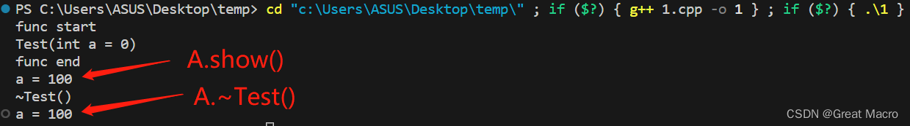

### 析构函数的特点
- 1、析构函数名与类名一致
- 2、析构函数不能构成重载，一个类只能有一个析构函数
- 3、析构函数无参
- 4、析构函数在对象被销毁时，自动调用
- 5、每个对象被销毁时，就调用一次析构函数
- 6、如果类设计者没有手动实现析构函数，编译器就会提供一个默认的析构函数，析构体为空，一经手动实现，则系统的默认函数就不复存在。
- 7、如果存在多个同类对象，调用析构函数顺序是最先创建的对象最后销毁，后创建的对象先销毁。
---

- 当对象作为返回值时，其调用析构函数的时间不是函数结束，而是接收这个对象的对象的销毁时间。
```c++
#include <iostream>
#include <cstring>
 
using namespace std;
 
class Test {
    int a;
   
public:
    Test(int a = 0)     // 普通构造函数
    {
        cout << "Test(int a = 0)" << endl;
        this->a = a;
    }
    Test(const Test &other) // 拷贝构造函数
    {
        cout << "Test(const Test &other)" << endl;
        this->a = other.a;
    }
   
    void show()
    {
        cout << "a = " << a << endl;
    }
    ~Test() // 析构函数
    {
        cout << "~Test()" << endl;
        show();
    }
};
 
Test func() {
    cout << "func start" << endl;
    Test B(100);
    cout << "func end" << endl;
    return B;
}
 
 
int main() {
    Test A = func();
    A.show();
    
    return 0;
}
```
