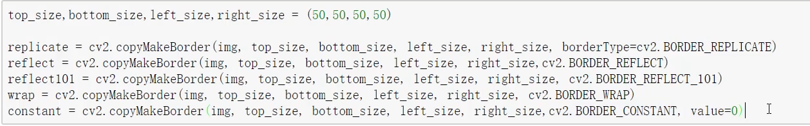
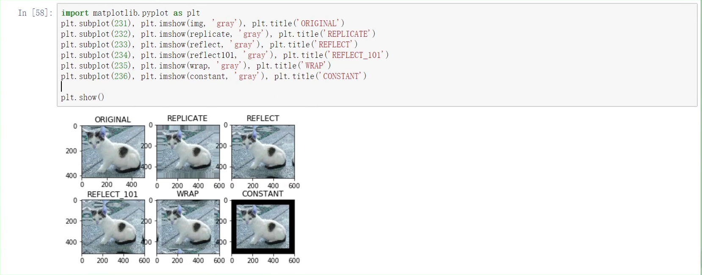
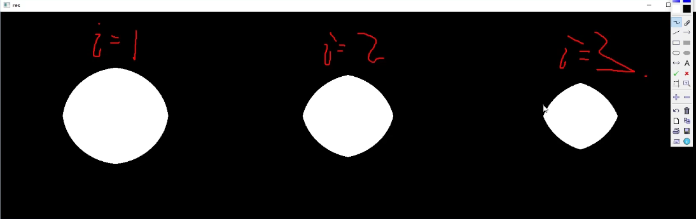
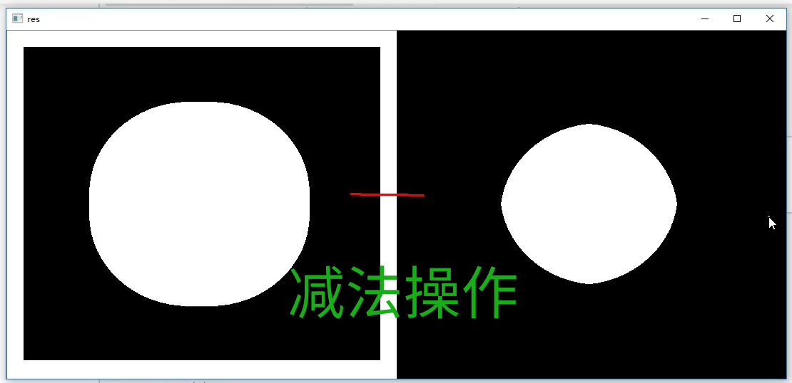
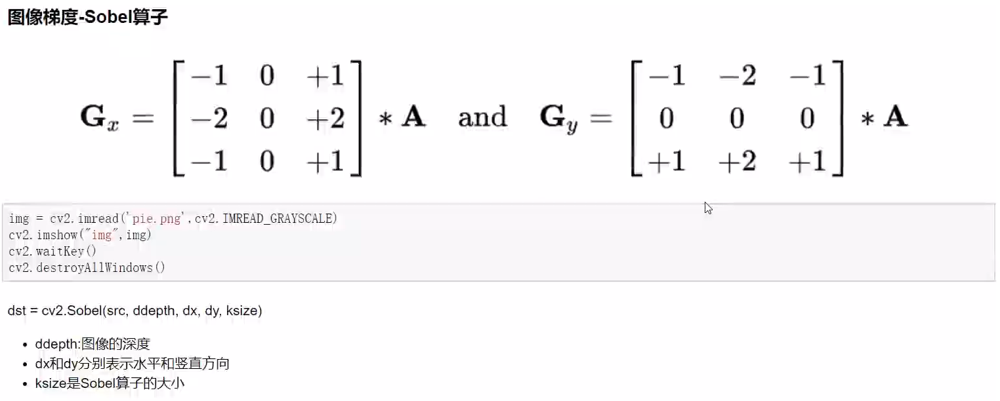
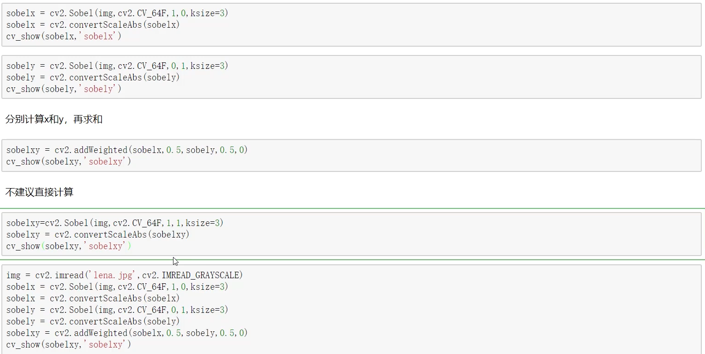
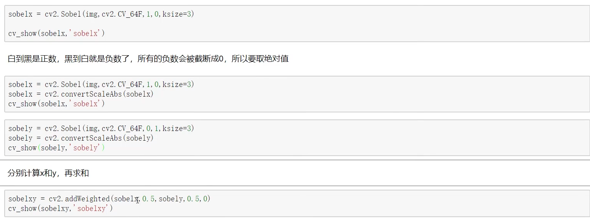
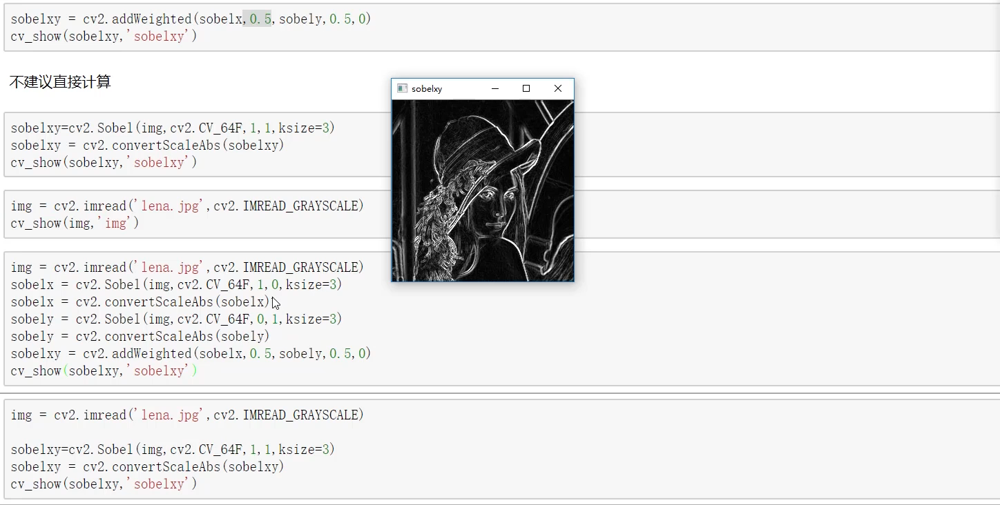

[TOC]
## 基本操作
### 读取 && 复制 && 写入
```c++
Mat src = cv::imread("../opencv.jpg", IMREAD_COLOR); // IMREAD_GREYSCALE
Mat cp = src.copy();
cv::imwrite("../opencv.jpg", src)
```
### 分离通道
```c++
std::vector<Mat> channels(3);
cv::split(this->src, channels);
cv::imshow("B", channels[0]);
cv::imshow("G", channels[1]);
cv::imshow("R", channels[2]);
// merge 合并
cv::merge(channels[0], channels[1], 0) // 合并BG图
```
### 取灰度图
```c++
cv::cvtColor(this->src, grayImg, COLOR_BGR2GRAY);
cv::imshow("gray", grayImg);
```
### ROI (取范围图)  
```c++
Mat crop = this->src(Range(10,170), Range(40, 200));
imshow("crop", crop);
```
### 边界填充




### 数值计算
- `img2 = img1 + 10`
  矩阵的每一个元的值 + 10
- `img1 + img2` 前提：维度一致
  矩阵对应的元相加并 % 256
- `cv::add(img1, img2)`
  不会%256，相应最大值为255，不会越界

### 图像融合
- `img_cat + img_dog`
  `shape` 值不一样，报错
  - `img_cat.shape` : `(400, 500, 3)`
    指的是 图片高（行数）400; 高（列数）500; 颜色通道数为3.
  - 正确融合方式 (python)：
    ```python
    img_dog = cv2.resize(img_dog, (500, 414))
    res = cv2.addWeighted(img_cat, 0,4, img_dog, 0.6, 0)
    # 0.4 0.6 表示图片所占权重，0是偏移
    # 权重越大，融合所展示的越明显
    ```
  - `resize` 另一种
    `res = cv2.resize(img, (0, 0), fx = 3, fy = 1)`
    图像长变为原来的3倍，高不变（1倍）
  - **图像拼接**
    ```c++
    // 拼接膨胀和腐蚀结果
    cv::Mat hstack;
    cv::hconcat(dilated, eroded, hstack);  // 水平拼接
    ```

### 图像绘制
```c++
line(drawn, Point(100, 200), Point(250, 250), Scalar(255, 0, 0), 2);
rectangle(drawn, Point(150, 250), Point(250, 300), Scalar(255, 255, 255), 2);
circle(drawn, Point(150, 300), 50, Scalar(100, 100, 0), 2);
putText(drawn, "text", Point(200, 250), 0, 0.5f, rgb(0, 0xFF, 0xFF), 2, cv::LINE_8);
imshow("drawn", drawn);
```

### 图像腐蚀 && 膨胀
```c++
Mat kernel = getStructuringElement(MORPH_RECT, Size2f(5.5, 5.5));
Mat dstImage;

cv::erode(this->src, dstImage, kernel);
cv::erode(dstImage, dstImage, kernel);
imshow("erode", dstImage);

cv::dilate(this->src, dstImage, kernel);
cv::dilate(dstImage, dstImage, kernel);
imshow("dilation", dstImage);
```


## 基本算法
### 开闭运算 && 梯度运算 && 礼帽黑帽

```c++
Mat kernel = getStructuringElement(MORPH_RECT, Size2f(5.5, 5.5));
// 开：先腐蚀，再膨胀
Mat open;
cv::morphologyEx(img, open, MORPH_OPEN, kernel);
// 闭：先膨胀，再腐蚀
Mat closing;
cv::morphologyEx(img, open, MORPH_CLOSE, kernel);
```
--- 
```c++
// 梯度运算（膨胀减去腐蚀）
cv::Mat gradient;
cv::morphologyEx(img, gradient, open, MORPH_GRADIENT, kernel);
```


---
```c++
// 礼帽：原始输入 - 开运算结果
cv::Mat tophat;
cv::morphologyEx(img, gradient, open, MORPH_TOPHAT, kernel);
// 黑帽：闭运算 - 原始输入
cv::Mat blackhat;
cv::morphologyEx(img, gradient, open, MORPH_BLACKHAT, kernel);
```

### Sobel 算子



