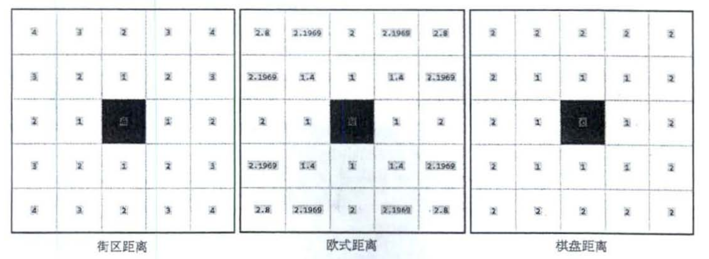

[TOC]
## 查询
---
### 第六章 图像形态学操作
- #### distanceTransform() -> P182
  用于计算不同像素之间的距离
  
- #### 邻域 -> P185
- #### connectedComponents()x2 -> P187
  提取图像中不同连通域
- #### cv::VideoCapture::get ：
    ```cpp
    virtual double cv::VideoCapture::get(int propId) const;
    参数
    propId：这是一个整数值，表示要查询的具体属性。OpenCV 定义了一些常见的属性 ID，使用 cv::CAP_PROP_* 常量。常见的属性 ID 包括：
    cv::CAP_PROP_FRAME_WIDTH：视频流的帧宽度。
    cv::CAP_PROP_FRAME_HEIGHT：视频流的帧高度。
    cv::CAP_PROP_FPS：视频的帧率（每秒帧数）。
    cv::CAP_PROP_FOURCC：视频的编码方式（四字符编码）。
    cv::CAP_PROP_POS_FRAMES：视频当前的位置（按帧计数）。
    cv::CAP_PROP_POS_MSEC：视频当前的位置（按毫秒计数）。
    cv::CAP_PROP_BRIGHTNESS：视频捕获的亮度。
    cv::CAP_PROP_CONTRAST：视频捕获的对比度。
    cv::CAP_PROP_SATURATION：视频捕获的饱和度。
    cv::CAP_PROP_HUE：视频捕获的色调。
    cv::CAP_PROP_GAIN：视频捕获的增益。
    返回值
    该函数返回一个 double 类型的值，表示请求的属性值。如果请求的属性不支持或发生错误，通常返回 NaN（非数字）。
    ```